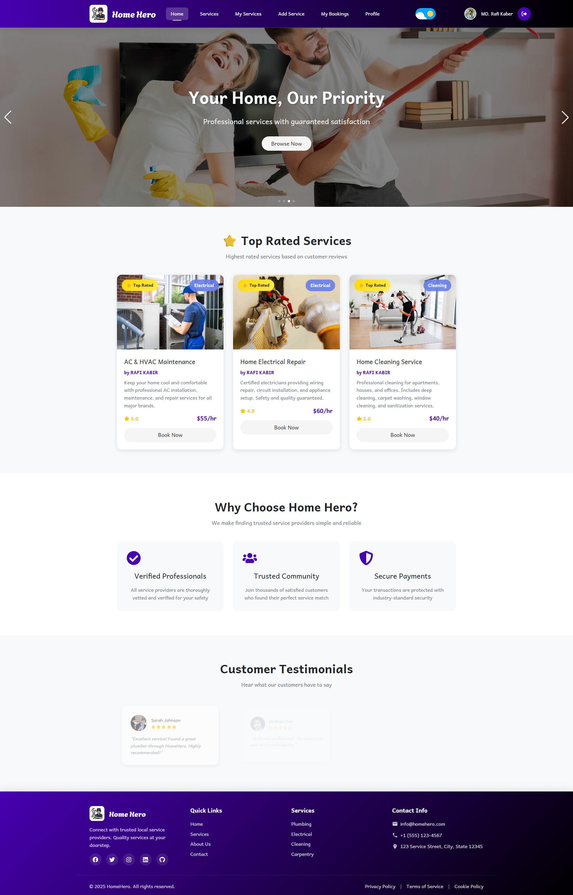
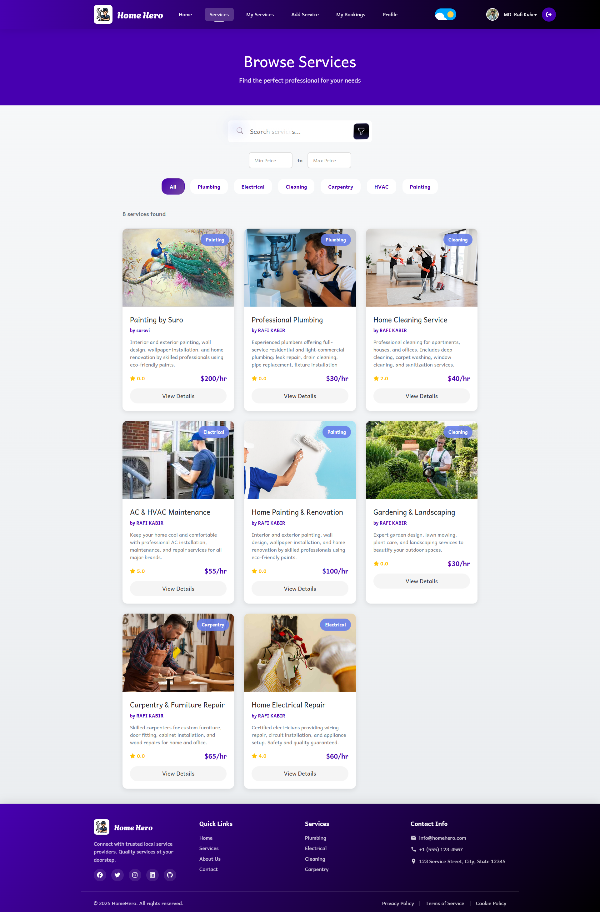
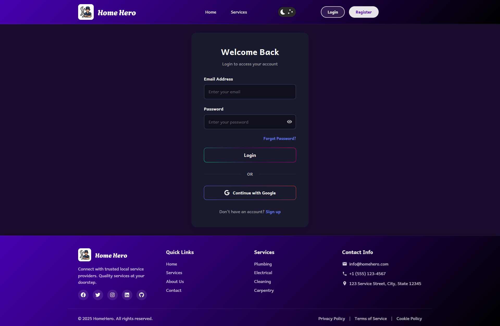
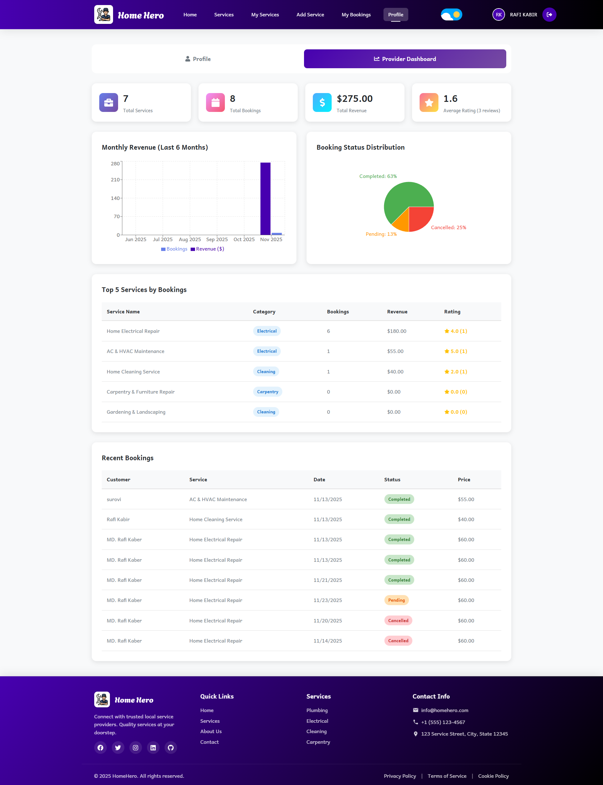
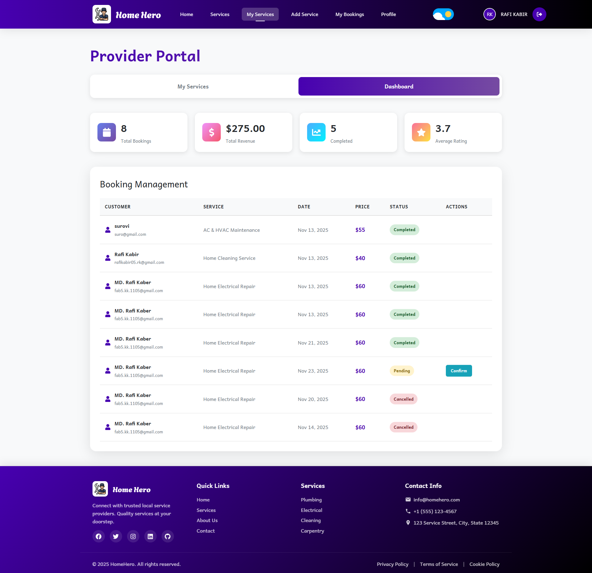
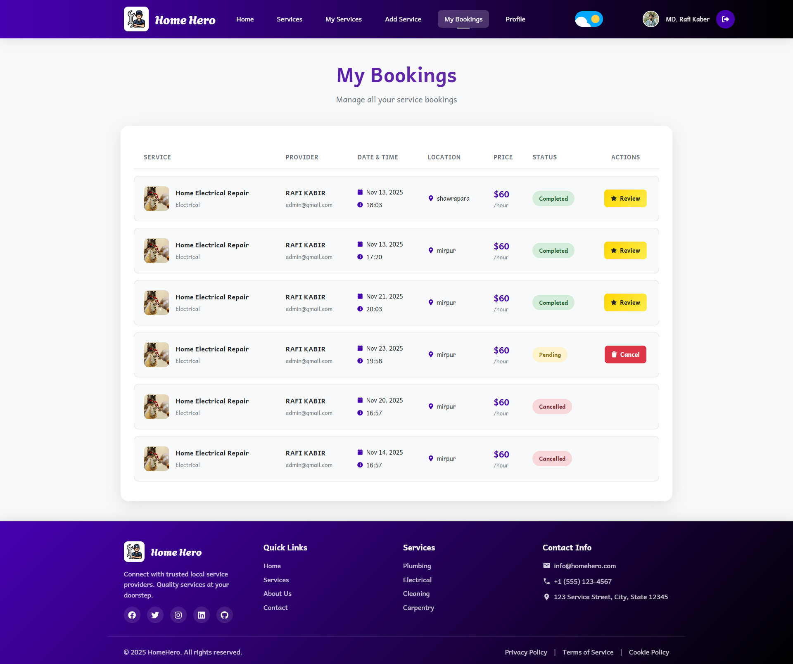

# HomeHero - Service Provider Platform

A modern fullstack web application connecting users with local service providers. Built with React, Node.js, Express, and MongoDB.


## 🚀 Features

- **User Authentication** - Email/password and Google sign-in via Firebase
- **Service Marketplace** - Browse and search local services
- **Provider Dashboard** - Manage services and bookings
- **Booking System** - Book services with date/time selection
- **Reviews & Ratings** - Rate and review service providers
- **Dark Mode** - Toggle between light and dark themes
- **Responsive Design** - Optimized for mobile, tablet, and desktop
- **Smooth Animations** - Framer Motion animations throughout

## 📁 Project Structure

```
hero-home/
├── hero-home-client/          # Frontend React application
│   ├── src/
│   │   ├── components/        # Reusable components
│   │   ├── contexts/          # React contexts (Auth, Theme)
│   │   ├── pages/             # Page components
│   │   ├── services/          # API services
│   │   └── config/            # Firebase configuration
│   └── package.json
│
├── hero-home-server/          # Backend Express application
│   ├── controllers/           # Request handlers
│   ├── models/                # Mongoose schemas
│   ├── routes/                # API routes
│   ├── config/                # Database configuration
│   └── package.json
│
└── README.md
```

## 🛠️ Tech Stack

### Frontend
- **React 19.2.0** - UI library
- **Vite** - Build tool
- **React Router DOM** - Routing
- **Styled Components** - CSS-in-JS
- **Tailwind CSS** - Utility CSS
- **Framer Motion** - Animations
- **Firebase Auth** - Authentication
- **Axios** - HTTP client
- **Swiper** - Carousel/Slider

### Backend
- **Node.js** - Runtime
- **Express** - Web framework
- **MongoDB** - Database
- **Mongoose** - ODM
- **JWT** - Authentication tokens
- **bcryptjs** - Password hashing

## 📦 Installation

### Prerequisites
- Node.js (v16 or higher)
- MongoDB (local or Atlas)
- Firebase project

### 1. Clone the repository
```bash
git clone <repository-url>
cd hero-home
```

### 2. Setup Backend

```bash
cd hero-home-server
npm install

# Copy environment file
copy .env.example .env

# Edit .env with your MongoDB URI and other configs
# MONGODB_URI=mongodb://localhost:27017/herohome
# or use MongoDB Atlas connection string

# Seed database with sample data (optional)
npm run seed

# Start server
npm run dev
```

Server runs on `http://localhost:5000`

### 3. Setup Frontend

```bash
cd hero-home-client
npm install

# Start development server
npm run dev
```

Client runs on `http://localhost:5173`

## 🔧 Environment Variables

### Backend (.env)
```env
PORT=5000
MONGODB_URI=mongodb://localhost:27017/herohome
JWT_SECRET=your_jwt_secret_key
CORS_ORIGIN=http://localhost:5173
```

### Frontend
Firebase config is in `src/config/firebase.config.js`

## 🎯 Usage

1. **Start MongoDB** (if using local)
2. **Start Backend Server**
   ```bash
   cd hero-home-server
   npm run dev
   ```
3. **Start Frontend App**
   ```bash
   cd hero-home-client
   npm run dev
   ```
4. **Open browser** - Navigate to `http://localhost:5173`

## 📱 Pages

- **/** - Home page with hero slider and featured services
- **/services** - Browse all services with search/filter
- **/login** - User login
- **/register** - User registration
- **/profile** - User profile (protected)
- **/my-services** - Provider's services (protected)
- **/add-service** - Create new service (protected)
- **/my-bookings** - User bookings (protected)

## 🔐 API Endpoints

### Services
- `GET /api/services` - Get all services
- `GET /api/services/:id` - Get service by ID
- `POST /api/services` - Create service
- `PUT /api/services/:id` - Update service
- `DELETE /api/services/:id` - Delete service
- `GET /api/services/user/:userId` - Get provider's services

### Bookings
- `GET /api/bookings` - Get all bookings
- `GET /api/bookings/:id` - Get booking by ID
- `POST /api/bookings` - Create booking
- `PUT /api/bookings/:id/status` - Update booking status
- `PUT /api/bookings/:id/cancel` - Cancel booking
- `GET /api/bookings/user/:userId` - Get user bookings

### Reviews
- `GET /api/reviews` - Get all reviews
- `GET /api/reviews/:id` - Get review by ID
- `POST /api/reviews` - Create review
- `PUT /api/reviews/:id` - Update review
- `DELETE /api/reviews/:id` - Delete review
- `GET /api/reviews/service/:serviceId` - Get service reviews

### Users
- `GET /api/users` - Get all users
- `GET /api/users/:id` - Get user by ID
- `POST /api/users` - Create user
- `PUT /api/users/:id` - Update user
- `DELETE /api/users/:id` - Delete user

## 🎨 Service Categories

- Plumbing
- Electrical
- Cleaning
- HVAC
- Carpentry
- Painting
- Gardening
- Pest Control

## 🌙 Dark Mode

Toggle dark mode using the switch in the header. Preference is saved to localStorage.

## 📸 Screenshots

### Home Page
The landing page features a hero slider with featured services and smooth animations.



### Service Marketplace
Browse all available services with search, filter, and category options.



### User Authentication
Secure login with email/password or Google sign-in via Firebase.



### Provider Dashboard
Service providers can manage their services with real-time status updates.



### Pending Services
Track and manage pending service requests efficiently.



### My Bookings
Users can view and manage all their service bookings in one place.



## 🤝 Contributing

1. Fork the repository
2. Create your feature branch (`git checkout -b feature/AmazingFeature`)
3. Commit your changes (`git commit -m 'Add some AmazingFeature'`)
4. Push to the branch (`git push origin feature/AmazingFeature`)
5. Open a Pull Request

## 📄 License

This project is licensed under the ISC License.

## 👨‍💻 Author

Your Name

## 🙏 Acknowledgments

- React team for the amazing library
- Firebase for authentication services
- MongoDB for the database
- All open-source contributors


